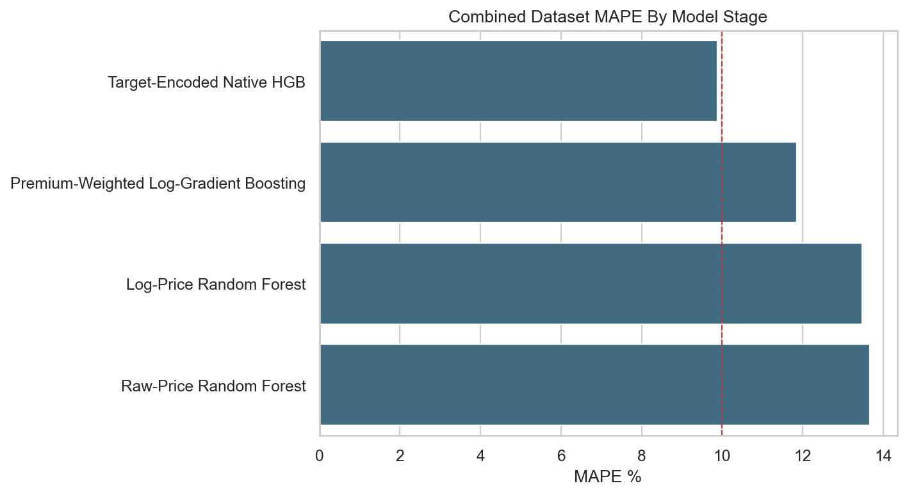
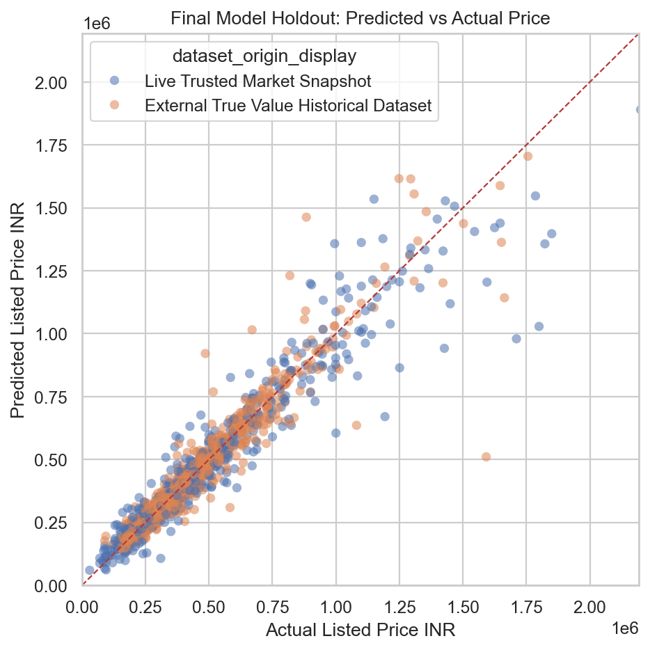
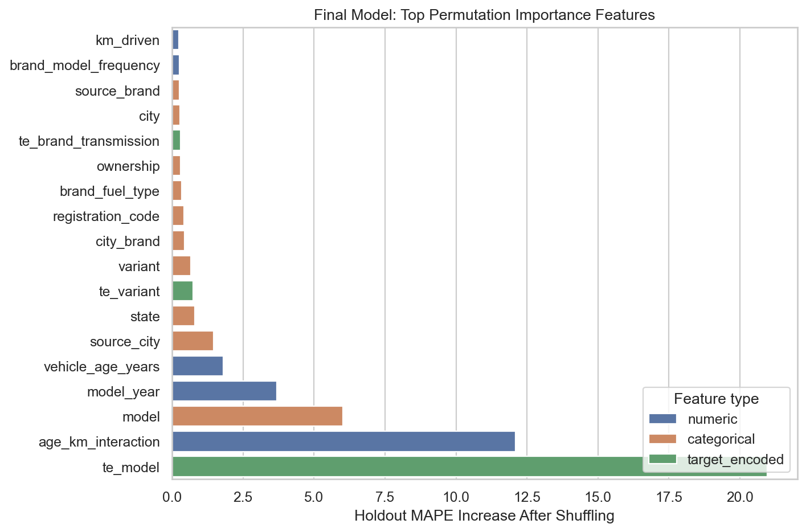
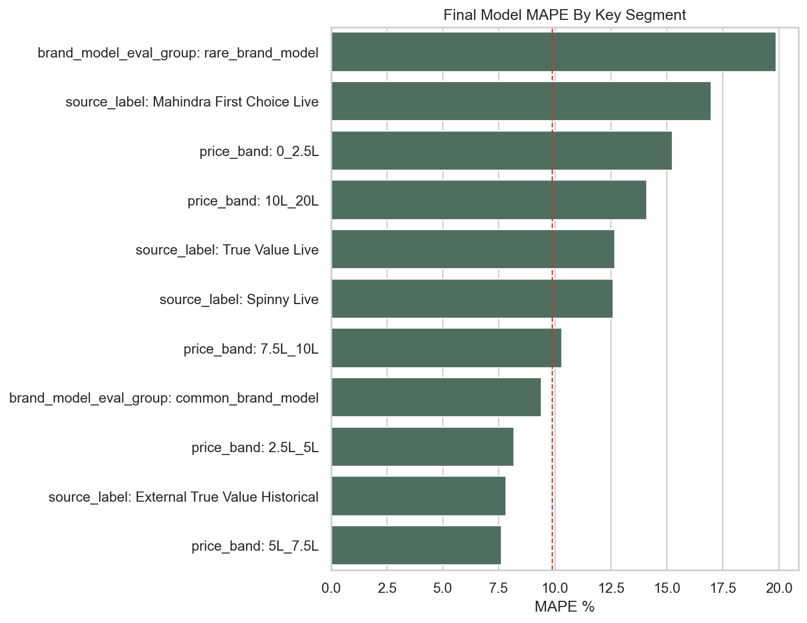

# Used Car Price Intelligence Platform

A data-first used-car pricing project built from trusted Indian used-car listing
sources. The project turns messy multi-source inventory data into modeling-ready
datasets, validates quality, trains pricing baselines, and documents the final
model with stability and interpretation evidence.

This is a new project, separate from the older single-page scraping notebook.
The older work proved the basic idea; this repository rebuilds it as a more
production-oriented data and modeling platform.

## What This Project Answers

- What is the expected listed price for a used car?
- Which listings are likely overpriced or underpriced?
- How do price patterns vary by city, brand, model, year, fuel type,
  transmission, ownership, source, and kilometers driven?
- Which data sources are reliable enough for modeling?
- Where does the model work well, and where does it still need improvement?

## Final Result

Final candidate:

| Model | Dataset | MAE | MAPE | R2 |
| --- | --- | ---: | ---: | ---: |
| Combined Trusted Lineage Target-Encoded Native HGB | Combined Trusted Modeling Dataset | 47,389 INR | 9.88% | 0.897 |

Repeated-split validation:

| Metric | Value |
| --- | ---: |
| Validation runs | 7 |
| Mean MAPE | 10.33% |
| MAPE range | 9.88% to 10.73% |
| Mean MAE | 47,589 INR |
| Mean R2 | 0.906 |

Correct claim:

> Built a trusted-source used-car price intelligence pipeline and trained a
> 10%-class price model, reaching 9.88% MAPE on the primary combined split and
> 10.33% mean MAPE across repeated validation splits.

Do not claim guaranteed sub-10% MAPE across every split. Premium/high-price
cars and rare brand-model groups remain harder than common normal-market cars.

## Model Evidence

### Model Progression



### Final Holdout Prediction Shape



### Model Trust Signals



### Segment Reliability



## Dataset Strategy

The first model intentionally uses trusted/evaluated inventory sources instead
of self-listed marketplaces. Self-listed marketplaces can be useful later, but
they introduce more seller-created noise, inconsistent fields, and weaker price
trust.

Final modeling datasets:

| Dataset | Rows | Role |
| --- | ---: | --- |
| Live Trusted Market Snapshot | 3,496 | Current-market trusted benchmark |
| External True Value Historical Dataset | 5,614 | Larger historical True Value benchmark |
| Combined Trusted Modeling Dataset | 9,110 | Main experimental dataset with lineage features |

Important distinction:

- `103,719` rows: observation-level scrape history with repeated listings
- `3,496` rows: deduped live unique listings
- `9,110` rows: combined supervised modeling dataset

The 103k observation file is useful for data collection and lifecycle analysis.
It is not the supervised training dataset.

## Reading Path

For a GitHub, portfolio, interview, Medium, LinkedIn, or YouTube review, read in
this order:

1. [Final GitHub Package](docs/60-final-github-package.md)
2. [Final Model Card](docs/61-final-model-card.md)
3. [Notebook Index](notebooks/README.md)
4. [Final EDA Notebook](notebooks/used_car_price_intelligence_final_eda.ipynb)
5. [Complete Modeling Story Notebook](notebooks/used_car_price_intelligence_complete_modeling_story.ipynb)
6. [Model Interpretation Notebook](notebooks/used_car_price_intelligence_model_interpretation.ipynb)
7. [Model Stability Validation Notebook](notebooks/used_car_price_intelligence_model_stability_validation.ipynb)

The full decision log remains in [docs/](docs/README.md).

## Repository Structure

```text
config/          Source registry, parser rules, batch targets, scale policy
docs/            Decision log, final package summary, model card, assets
kaggle_upload/   Local Kaggle dataset package metadata and upload notes
notebooks/       EDA, modeling, interpretation, validation notebooks
src/             Acquisition, parsing, quality, reporting, and packaging code
tests/           Unit tests and source fixtures
```

## Core Pipeline


## Modeling Journey

| Stage | Model | Main Learning |
| ---: | --- | --- |
| 1 | Raw-price Random Forest | Serious baseline: 13.66% combined MAPE |
| 2 | Log-price Random Forest | Slight relative-error improvement, high-price tail still weak |
| 3 | Premium-weighted Log-HGB | Better premium-tail behavior, 11.86% combined MAPE |
| 4 | Target-encoded Native HGB | Best primary checkpoint: 9.88% combined MAPE |
| 5 | Repeated-split validation | Mean MAPE 10.33%; strong, not guaranteed sub-10 |

## Model Interpretation Summary

The strongest predictive signals are market-relevant:

- model identity and target-encoded model signal
- vehicle age and model year
- kilometer and age interaction
- city/source context
- variant, registration, fuel, and transmission context

Holdout error distribution:

| Error band | Rows | Share |
| --- | ---: | ---: |
| <= 5% | 722 | 39.63% |
| <= 10% | 1,215 | 66.68% |
| <= 15% | 1,477 | 81.06% |
| > 25% | 132 | 7.24% |

The final model is strongest for common, normal-market vehicles. It is weaker
for rare brand-model groups, very low-price listings, and higher-price/premium
vehicles.

## Local Setup

Install notebook/modeling dependencies:

```powershell
python -m venv .venv
.\.venv\Scripts\python -m pip install -e ".[notebook,dev]"
```

Run tests:

```powershell
python -m pytest
```

Run the main notebooks as scripts:

```powershell
python notebooks/used_car_price_intelligence_complete_modeling_story.py
python notebooks/used_car_price_intelligence_model_interpretation.py
```

For live acquisition work, also install the acquisition extra and Playwright:

```powershell
.\.venv\Scripts\python -m pip install -e ".[acquisition,notebook,dev]"
.\.venv\Scripts\python -m playwright install chromium
```

## Kaggle Dataset Package

Notebook dataset path used on Kaggle:

```text
/kaggle/input/datasets/hrushikeshnettetla/used-car-price-trusted-modeling-datasets
```

Local upload package:

```text
kaggle_upload/used-car-price-intelligence-trusted-modeling-datasets/
```

CSV files are intentionally ignored by Git. See
[kaggle_upload/README.md](kaggle_upload/README.md) for upload details.

## License And Data Use

The project code and documentation are released under the
[MIT License](LICENSE).

Dataset rights are separate from the code license. The external True Value
dataset package is tracked with its recorded `CC0-1.0` metadata. Live scraped
CSV files are intentionally excluded from Git and should not be redistributed
publicly unless the relevant source terms permit it.

## Known Limitations

- The target is listed price, not final transaction price.
- The model is not a production valuation system.
- Premium/high-price vehicles need a separate improvement track.
- Rare brand-model rows need more data or fallback logic.
- Live-market source drift should be monitored before deployment.
- Self-listed marketplace data is intentionally excluded from the first model.

## Final Position

This project is a credible portfolio-grade used-car price intelligence platform:
it prioritizes trusted data, transparent modeling, documented limitations, and
repeatable validation. The next production step would be monitoring, premium-tail
calibration, and a lightweight application layer on top of the model.
