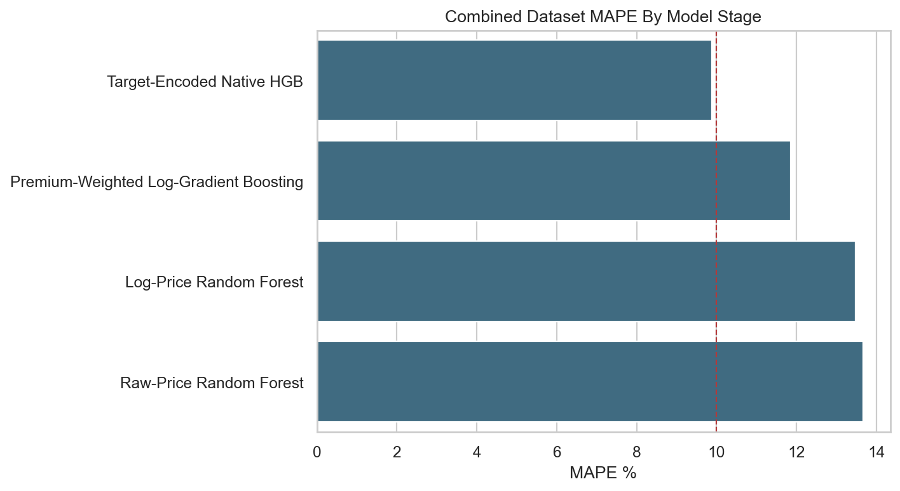
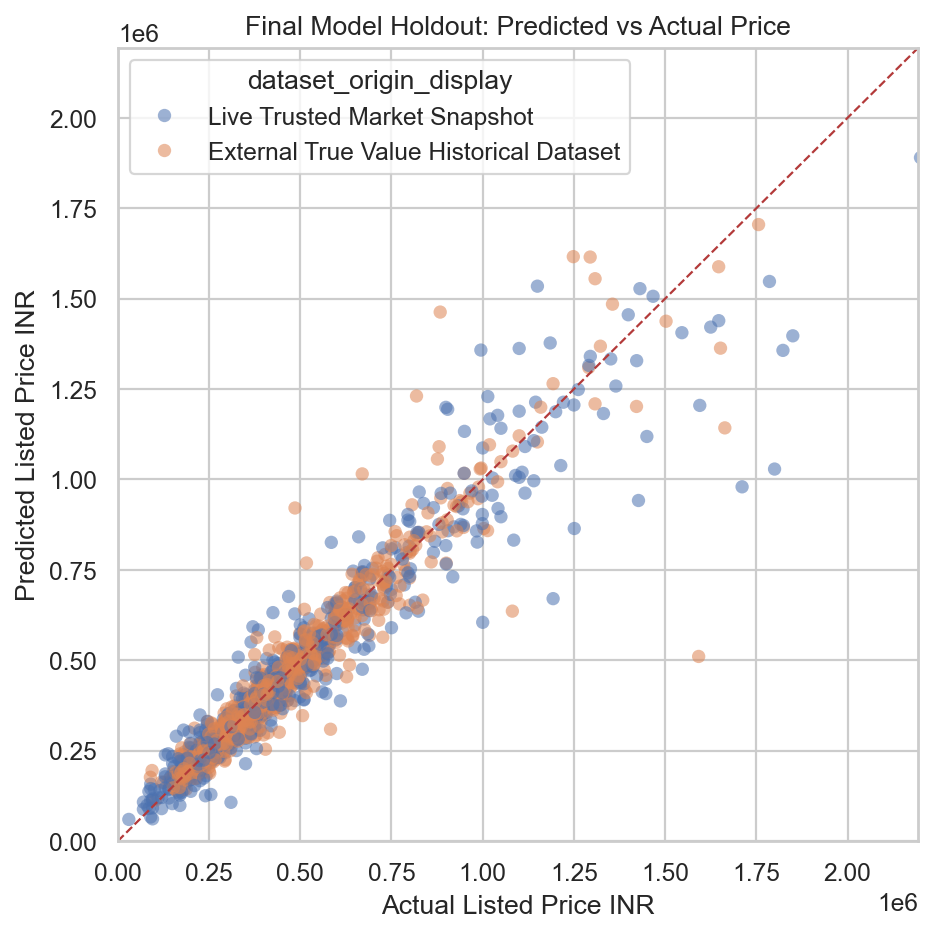
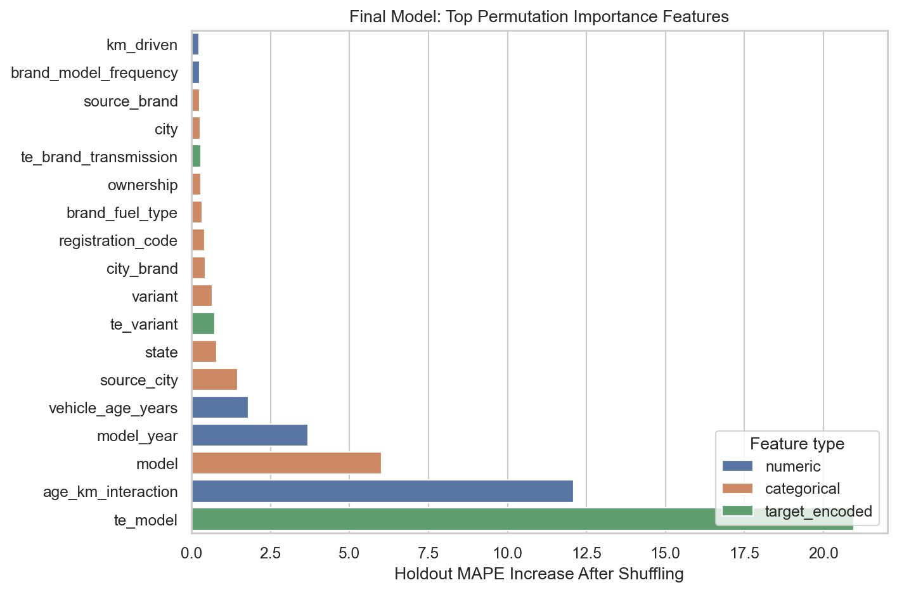
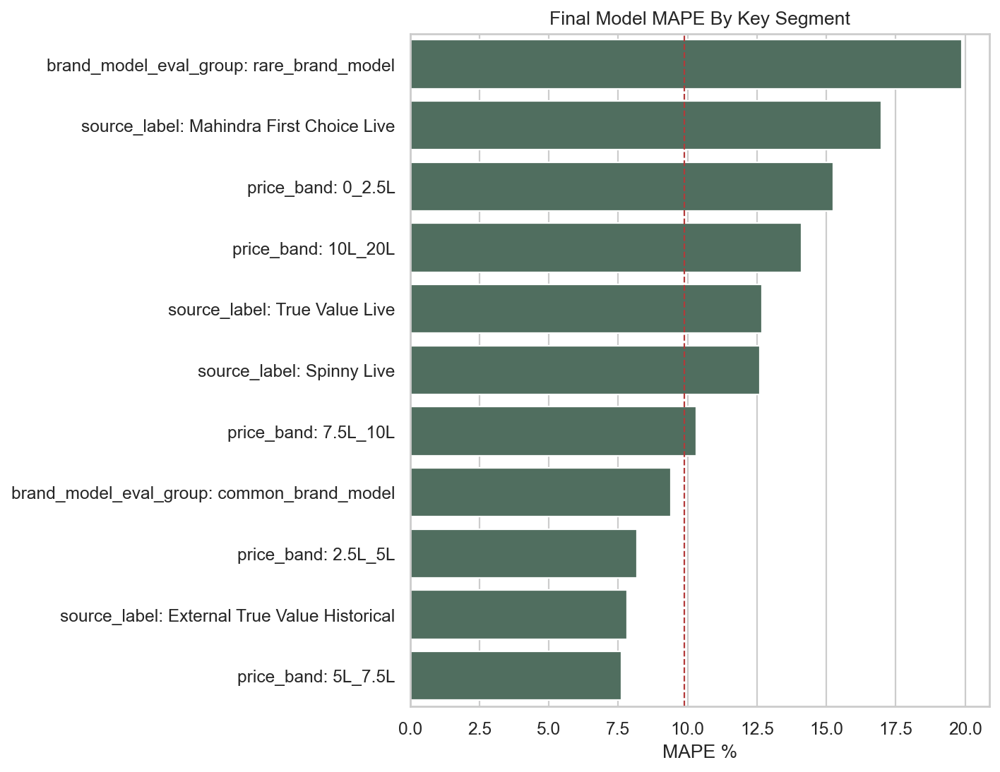

# Used Car Price Intelligence Platform

Predicts the **listed asking price** of used cars in India from trusted inventory
sources — not a dealer quote, not a final transaction price, and not a production
valuation system. It is a portfolio-grade data → model → API platform: trusted
listings in, transparent estimates and documented limits out.

**Live demo:**
[https://used-car-price-intelligence-platfor.vercel.app](https://used-car-price-intelligence-platfor.vercel.app)

> Built a trusted-source used-car price intelligence pipeline and trained a
> 10%-class price model, reaching 9.88% MAPE on the primary combined split and
> 10.33% mean MAPE across repeated validation splits.

**Holdout (combined trusted, 9,110 rows):** MAPE **9.88%** · R² **0.897** · MAE **47,389 INR**

Repeated splits: mean MAPE **10.33%** (range 9.88–10.73). Do not claim guaranteed
sub-10% MAPE on every split — premium/high-price and rare brand-model groups remain harder.

- **Trusted data** — evaluated inventory sources and lineage features, not noisy self-listed marketplace dumps
- **Model journey** — baselines → log-price / premium-aware boosting → target-encoded native HGB at 9.88% MAPE, with repeated-split stability checks
- **Shipped API / UI / MLOps** — FastAPI + web UI on Vercel; MLOps v2 adds Docker, GitHub Actions CI, prediction JSONL logging, and a drift report ([MLOPS_V2.md](MLOPS_V2.md), [docs/70-mlops-v2.md](docs/70-mlops-v2.md))

## How it was built

- Multi-source acquisition, canonical schema, quality gates, and deduped modeling sets (9,110-row combined trusted dataset)
- Iterative modeling with holdout metrics, segment error analysis, and interpretation (permutation importance)
- Repeated-split validation (mean MAPE 10.33%) so the headline number is not a one-split fluke
- Prediction API and web UI deployed to Vercel
- MLOps v2 packaging: Docker / Compose, CI, prediction logs, and scripted drift reporting

## Reading path

1. **[Live demo](https://used-car-price-intelligence-platfor.vercel.app)** — try a prediction
2. **This README** — claims, metrics, evidence charts below
3. **[Final Model Card](docs/61-final-model-card.md)** — scope, limits, how to talk about the model
4. **[Complete Modeling Story Notebook](notebooks/used_car_price_intelligence_complete_modeling_story.ipynb)** — end-to-end modeling narrative
5. **[MLOPS_V2.md](MLOPS_V2.md)** — Docker, CI, prediction JSONL, drift report

## Model Evidence

### Model Progression



### Final Holdout Prediction Shape



### Model Trust Signals



### Segment Reliability



## Dataset Strategy

The first model intentionally uses trusted/evaluated inventory sources instead
of self-listed marketplaces. Self-listed marketplaces can be useful later, but
they introduce more seller-created noise, inconsistent fields, and weaker price
trust.

Final modeling datasets:

| Dataset | Rows | Role |
| --- | ---: | --- |
| Live Trusted Market Snapshot | 3,496 | Current-market trusted benchmark |
| External True Value Historical Dataset | 5,614 | Larger historical True Value benchmark |
| Combined Trusted Modeling Dataset | 9,110 | Main experimental dataset with lineage features |

Important distinction:

- `103,719` rows: observation-level scrape history with repeated listings
- `3,496` rows: deduped live unique listings
- `9,110` rows: combined supervised modeling dataset

The 103k observation file is useful for data collection and lifecycle analysis.
It is not the supervised training dataset.

## Decision log (archive)

Longer design notes, collection runbooks, and review docs live under
[docs/](docs/README.md). Useful deep dives if you want the full trail:

1. [Final GitHub Package](docs/60-final-github-package.md)
2. [Final Model Card](docs/61-final-model-card.md)
3. [Notebook Index](notebooks/README.md)
4. [Final EDA Notebook](notebooks/used_car_price_intelligence_final_eda.ipynb)
5. [Complete Modeling Story Notebook](notebooks/used_car_price_intelligence_complete_modeling_story.ipynb)
6. [Model Interpretation Notebook](notebooks/used_car_price_intelligence_model_interpretation.ipynb)
7. [Model Stability Validation Notebook](notebooks/used_car_price_intelligence_model_stability_validation.ipynb)

## Repository Structure

```text
config/          Source registry, parser rules, batch targets, scale policy
docs/            Decision log, model card, MLOps notes, assets
kaggle_upload/   Local Kaggle dataset package metadata and upload notes
notebooks/       EDA, modeling, interpretation, validation notebooks
scripts/         Drift report, API runners, smoke / export helpers
src/             Acquisition, parsing, quality, modeling, and api/ (FastAPI + static UI)
tests/           Unit tests and source fixtures
artifacts/       Model package and monitoring reference stats
reports/         Generated drift report and related outputs
```

## Core Pipeline


```mermaid
flowchart LR
    A["Trusted listing sources"] --> B["Raw capture"]
    B --> C["Source parser"]
    C --> D["Canonical listing schema"]
    D --> E["Quality gates"]
    E --> F["Deduped modeling datasets"]
    F --> G["EDA and model training"]
    G --> H["Validation and interpretation"]
```

## Modeling Journey

| Stage | Model | Main Learning |
| ---: | --- | --- |
| 1 | Raw-price Random Forest | Serious baseline: 13.66% combined MAPE |
| 2 | Log-price Random Forest | Slight relative-error improvement, high-price tail still weak |
| 3 | Premium-weighted Log-HGB | Better premium-tail behavior, 11.86% combined MAPE |
| 4 | Target-encoded Native HGB | Best primary checkpoint: 9.88% combined MAPE |
| 5 | Repeated-split validation | Mean MAPE 10.33%; strong, not guaranteed sub-10 |

## Model Interpretation Summary

The strongest predictive signals are market-relevant:

- model identity and target-encoded model signal
- vehicle age and model year
- kilometer and age interaction
- city/source context
- variant, registration, fuel, and transmission context

Holdout error distribution:

| Error band | Rows | Share |
| --- | ---: | ---: |
| <= 5% | 722 | 39.63% |
| <= 10% | 1,215 | 66.68% |
| <= 15% | 1,477 | 81.06% |
| > 25% | 132 | 7.24% |

The final model is strongest for common, normal-market vehicles. It is weaker
for rare brand-model groups, very low-price listings, and higher-price/premium
vehicles.

## Local Setup

Install notebook/modeling dependencies:

```powershell
python -m venv .venv
.\.venv\Scripts\python -m pip install -e ".[notebook,dev]"
```

Run tests:

```powershell
python -m pytest
```

Run the main notebooks as scripts:

```powershell
python notebooks/used_car_price_intelligence_complete_modeling_story.py
python notebooks/used_car_price_intelligence_model_interpretation.py
```

For live acquisition work, also install the acquisition extra and Playwright:

```powershell
.\.venv\Scripts\python -m pip install -e ".[acquisition,notebook,dev]"
.\.venv\Scripts\python -m playwright install chromium
```

## Kaggle Dataset Package

Notebook dataset path used on Kaggle:

```text
/kaggle/input/datasets/hrushikeshnettetla/used-car-price-trusted-modeling-datasets
```

Local upload package:

```text
kaggle_upload/used-car-price-intelligence-trusted-modeling-datasets/
```

CSV files are intentionally ignored by Git. See
[kaggle_upload/README.md](kaggle_upload/README.md) for upload details.

## License And Data Use

The project code and documentation are released under the
[MIT License](LICENSE).

Dataset rights are separate from the code license. The external True Value
dataset package is tracked with its recorded `CC0-1.0` metadata. Live scraped
CSV files are intentionally excluded from Git and should not be redistributed
publicly unless the relevant source terms permit it.

## Deployment

The prediction API and web UI can be deployed to Vercel as a single Python
FastAPI function. See
[docs/68-vercel-deployment.md](docs/68-vercel-deployment.md) for prerequisites,
CLI and Git setup, smoke checks, rollback, and serverless constraints.

**Live application:**
[used-car-price-intelligence-platfor.vercel.app](https://used-car-price-intelligence-platfor.vercel.app)

Quick preview (from repo root, with the model package present):

```powershell
npx vercel@latest
```

## Known Limitations

- The target is listed price, not final transaction price.
- The model is not a production valuation system.
- Premium/high-price vehicles need a separate improvement track.
- Rare brand-model rows need more data or fallback logic.
- Live-market source drift must be monitored while interpreting deployed
  estimates.
- Self-listed marketplace data is intentionally excluded from the first model.

## Final Position

This project is a credible portfolio-grade used-car price intelligence platform:
it prioritizes trusted data, transparent modeling, documented limitations, and
repeatable validation. The next production step would be monitoring, premium-tail
calibration, and a lightweight application layer on top of the model.
