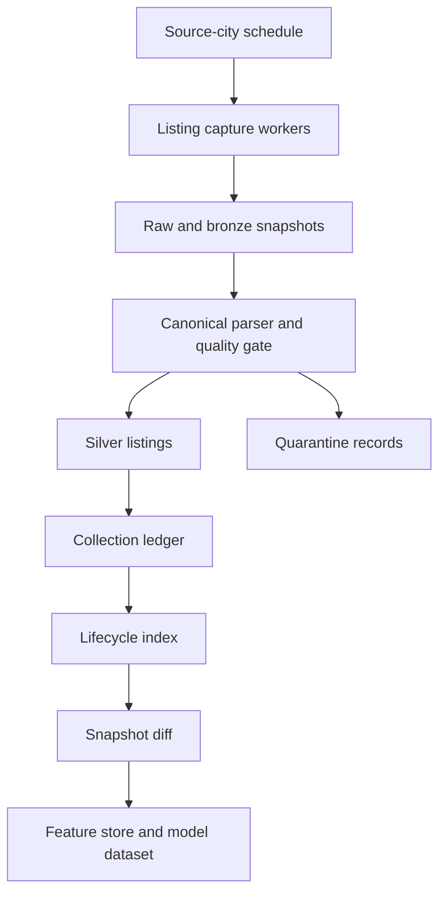

# 100k Trusted Collection Scale Runbook

Date: 2026-06-26

## Question

When should we move from the current 909-row trusted baseline to high-scale collection, and how can we reach about 100,000 rows in less time without damaging data quality?

## Short Answer

Do not start full 100k scraping yet.

The next step is one repeated equivalent snapshot over the same trusted source-city scope:

- Spinny: 5 cities, 300 current baseline rows.
- True Value: 5 cities, 429 current baseline rows.
- Mahindra First Choice: 5 cities, 180 current baseline rows.

After that repeat snapshot passes quality gates and the snapshot diff makes sense, we can scale.

The 100k target should be treated as 100k trusted observations over repeated snapshots, not 100k unique active cars from one scraping run. Trusted dealer/OEM inventory is limited on any given day, so repeated observations are the realistic production path.

## Current Baseline

Snapshot:

```text
snapshot_20260626_trusted_v2_baseline
```

Baseline totals:

| Metric | Count |
| --- | ---: |
| Source-city runs | 15 |
| Pricing-ready rows | 909 |
| Quarantined rows | 0 |
| Unique listing keys | 909 |

By source:

| Source | Rows |
| --- | ---: |
| Spinny | 300 |
| True Value | 429 |
| Mahindra First Choice | 180 |

Current same-scope math:

| Snapshot Size | Snapshots Needed For 100k |
| ---: | ---: |
| 909 rows | about 111 snapshots |
| 5,000 rows | about 20 snapshots |
| 10,000 rows | about 10 snapshots |

So the faster path is not just "scrape harder." The faster path is:

1. Repeat the current baseline once to prove the lifecycle system.
2. Expand source-city scope.
3. Prioritize faster structured sources first.
4. Add bounded parallel workers.
5. Avoid re-fetching expensive detail pages for unchanged known listings.
6. Store every snapshot so repeated observations become model features.

## Go/No-Go Gates For High Scale

High-scale collection starts only after these gates pass:

| Gate | Requirement |
| --- | --- |
| Repeat snapshot | Same source-city scope runs once more and produces ledger, lifecycle, and snapshot diff artifacts. |
| Required completeness | Pricing-critical fields stay at 100 percent completeness. |
| High-value completeness | At least 95 percent on fields used for modeling and comparables. |
| Quarantine rate | Less than or equal to 1 percent, ideally 0 percent. |
| Lifecycle stability | Listing keys remain stable and duplicate groups are explainable. |
| Coverage stability | Removed listings are interpreted only when current scrape coverage is equivalent. |
| Resume behavior | Batch runner can resume from previous manifests and skip passed jobs. |

If any gate fails, fix the pipeline before increasing row volume.

## Recommended Scaling Lanes

### Lane 1: True Value

Use first for expansion.

Reason:

- It currently produced the highest trusted row count.
- It has structured OEM-certified inventory.
- Dealer discovery plus listing capture is faster than detail-heavy browser scraping.

Initial scale tactic:

- Add more cities and dealer radii.
- Run 2-3 source-city jobs in bounded parallel only after one same-scope repeat succeeds.
- Keep dealer discovery and listing capture tied to the same snapshot date.

### Lane 2: Mahindra First Choice

Use second for expansion.

Reason:

- Multi-brand inventory improves model diversity.
- Website mechanics differ from Spinny and True Value, so it should remain source-specific in orchestration.

Initial scale tactic:

- Keep MFC as its own lane.
- Use at most 1-2 parallel city jobs initially.
- Treat low-inventory cities carefully. A city with only 3 source-reported listings can still be complete.

### Lane 3: Spinny

Use as quality anchor, not as the first high-volume lane.

Reason:

- Strong trusted/evaluated inventory.
- Detail enrichment is valuable but slow.

Initial scale tactic:

- Keep one Spinny city job at a time until incremental detail fetching is implemented.
- Split Spinny into two phases: listing-card capture first, detail-page enrichment second.
- Do not re-fetch detail pages for listing keys already observed unless price, availability, or card fields changed.

## Faster Collection Design

The production design should be a work queue, not one giant command.



Use bounded parallelism:

| Source | Initial Parallelism | Notes |
| --- | ---: | --- |
| True Value | 2-3 city jobs | Best first candidate for speed. |
| Mahindra First Choice | 1-2 city jobs | Keep separate due website behavior. |
| Spinny | 1 city job | Add separate detail queue before increasing. |

Avoid global parallel scraping across all sources at once. Each source needs its own delay, retry, and failure policy.

## Kaggle Decision

Kaggle can help this project, but it should not be the primary live scraper.

Recommended Kaggle use:

- EDA notebooks.
- Model training experiments.
- Sharing sanitized gold/snapshot artifacts.
- Running snapshot diff or feature-building on uploaded data.
- Building portfolio notebooks for Medium, LinkedIn, and YouTube.

Not recommended as the primary acquisition worker:

- Long-running scraping needs durable checkpoints.
- Browser-based capture needs stable Playwright/browser behavior.
- Source-specific throttling and retries are easier on a local machine or cloud VM.
- Secrets and dataset persistence are cleaner when separated from scraping.

Kaggle bridge plan:

1. Keep scraping/orchestration in this repo.
2. Export selected gold artifacts into a Kaggle dataset when needed.
3. Run Kaggle notebooks against those artifacts for analysis/modeling.
4. Bring generated analysis reports or model metrics back into this repo.

Official references checked on 2026-06-26:

- Kaggle Notebooks documentation: https://www.kaggle.com/docs/notebooks
- Kaggle API documentation: https://www.kaggle.com/docs/api
- Kaggle API repository: https://github.com/Kaggle/kaggle-api

## Infrastructure Options

| Option | Use For | Verdict |
| --- | --- | --- |
| Local machine | Current acquisition and debugging | Best short-term option. |
| Kaggle notebook | EDA, modeling, artifact review | Use as analysis bridge, not scraper. |
| GitHub Actions | Small scheduled checks | Not for large scraping. |
| Cloud VM | Scheduled acquisition workers | Best production-like option after repeat snapshot. |
| Prefect or Dagster | Orchestration and retries | Add after source lanes stabilize. |
| DuckDB or Postgres | Feature tables and snapshot analytics | Add before modeling scale-up. |
| Object storage | Raw/bronze/silver/gold artifact storage | Add before high-scale recurring runs. |

## When We Go For 100k

We move to high-scale after:

1. The next repeated same-scope snapshot passes.
2. The snapshot diff reports reasonable added, removed, still-active, and changed listing counts.
3. True Value and MFC can run in bounded parallel without quality regression.
4. Spinny has incremental detail enrichment, or we accept Spinny as lower-volume high-quality data.
5. We have a storage plan for repeated snapshots and model training tables.

Practical path:

| Phase | Target | What We Do |
| --- | ---: | --- |
| Now | 909 | Baseline complete. |
| Next | about 1,800 | Repeat same source-city scope and diff. |
| Small scale | 5,000 | Add more cities and repeat snapshots. |
| Medium scale | 25,000 | Scheduled snapshots, bounded parallel workers, storage hardening. |
| High scale | 100,000 | Automated recurring snapshots and feature tables. |

## Immediate Next Engineering Work

The next code step should be parallel-safe orchestration, but only after the repeat snapshot run:

1. Run the same 15 validated source-city jobs again.
2. Build `trusted_collection_v3`.
3. Build `listing_lifecycle_v1`.
4. Run `snapshot-diff` against `listing_lifecycle_v0`.
5. Review movement counts by source.
6. Then implement bounded parallel execution in the batch runner.

This gives us evidence before we add concurrency.
